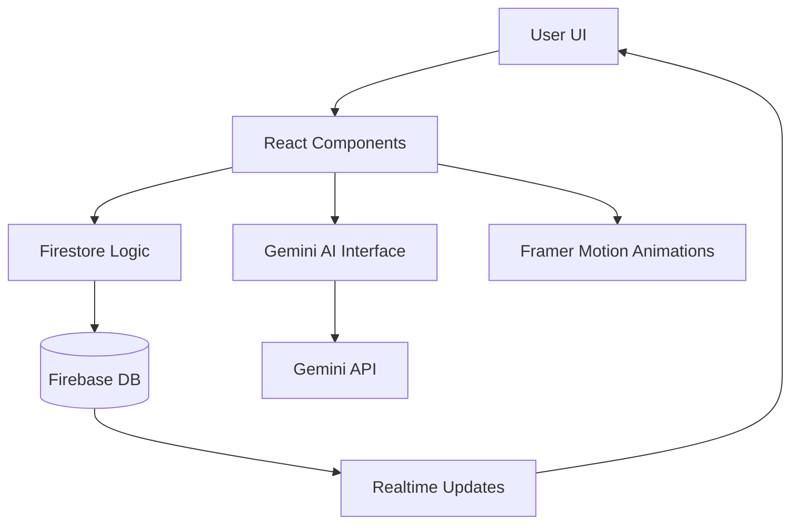

# 🌿 EcoSpark: Project Overview & Technical Guide

**EcoSpark** is a next-generation sustainability platform designed for the **TechSangram**. It gamifies environmental consciousness by turning real-world sustainable actions into digital rewards through AI verification and community competition.

---

## 🚀 1. The Mission
The global waste crisis and climate change often feel overwhelming to individuals. **EcoSpark** bridges the gap between intention and action by:
- **Validating** real-world eco-actions using AI (Eco-Eye).
- **Socializing** sustainability via leaderboards and challenges.
- **Educating** users through bite-sized, interactive content.

---

## 🛠️ 2. Technology Stack
We chose a cutting-edge, scalable stack to ensure a premium user experience:

| Layer | Technology | Purpose |
| :--- | :--- | :--- |
| **Frontend** | **React 19** + **Vite** | Blazing-fast performance and modern component architecture. |
| **Styling** | **Vanilla CSS** + **Framer Motion** | "Minimalist Zen" design with 60FPS fluid animations. |
| **Backend** | **Firebase** | Real-time synchronization of points, streaks, and user data. |
| **Intelligence** | **Google Gemini AI** | Computer vision for verifying recycled items, plants, and tasks. |
| **Mapping** | **Leaflet** | Interactive local impact mapping (focus: Roorkee / Haridwar). |
| **PWA** | **Vite PWA Plugin** | Offline support and "Install to Desktop/Mobile" capability. |

---

## ✨ 3. Core Features & "How they Work"

### 👁️ Eco-Eye: AI Verification Hub
The crown jewel of EcoSpark. 
- **Tech**: Integrated with the **Gemini 2.5 Flash** model via `@google/generative-ai`.
- **Workflow**: User captures a photo → Image sent to Gemini with a custom system prompt → AI identifies the object, gives it an "Eco Score" (1-10), and suggests a sustainability tip.
- **Result**: EcoPoints are automatically awarded if the action is verified.

### 🗺️ Eco-Impact Map
A localized map focused on **Haridwar University** and the **Roorkee** region.
- **Function**: Displays "Eco Stations" and areas where users have made an impact.
- **Tech**: Uses `react-leaflet` with custom map markers.

### 🏆 Gamification Engine
A robust system designed to keep students engaged:
- **EcoPoints & Levels**: 10 distinct ranks from *Eco-Seed* to *Earth Guardian*.
- **Streaks**: Encourages daily engagement; missing a day resets your streak.
- **Badges**: 20+ unlockable achievements (e.g., "Waste Warrior", "Solar Sage").
- **Leaderboard**: Real-time global ranking fetched from Firebase Firestore.

---

## 🏗️ 4. System Architecture

---

## 🎨 5. Design Philosophy: "Minimalist Zen"
We avoided the cluttered, dark "gamer" aesthetic in favor of a clean, nature-focused design:
- **Color Palette**: Primary Teal (`#2DD4BF`), Emerald (`#10B981`), and deep Dark Slate (`#0F172A`).
- **Typography**: Clean, geometric sans-serif fonts for readability.
- **Motion**: Every button press and page transition uses "spring" physics to feel physical and responsive.

---

## 📦 6. How to Run Locally
1. **Clone the Repo**.
2. **Install Dependencies**: `npm install`.
3. **Environment Setup**: Add your `VITE_GEMINI_API_KEY` to `.env.local`.
4. **Development Mode**: `npm run dev`.
5. **Build for Production**: `npm run build` (Outputs a PWA-ready `dist` folder).

---

> [!NOTE]
> This `README.md` was automatically generated to provide a comprehensive project overview.
